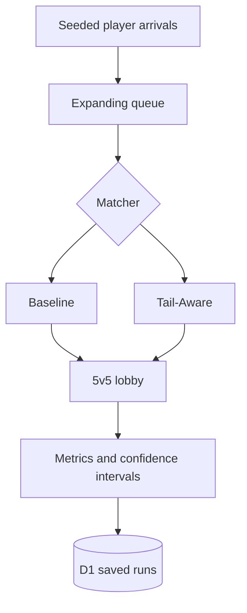

# RiftQueue

RiftQueue is a full-stack discrete-event simulation for studying the tradeoff
between queue time and match quality in sparse, high-ELO matchmaking pools.

It compares two synthetic matchmaking strategies:

- **Baseline:** an expanding skill window with snake-draft team assignment.
- **Tail-Aware:** protects scarce players at the edges of the MMR distribution
  and searches for a lower-cost 5v5 team split.

RiftQueue is inspired by competitive tactical shooters, but it does not use
Riot Games data, hidden MMR, production rules, or internal infrastructure. All
players, arrivals, ranks, and results are simulated.

## Why RiftQueue

I built RiftQueue after experiencing high-ELO ranked lobbies that could feel
inconsistent even when their visible averages looked close. It is a synthetic
way to explore questions about late-night populations, queue-time tradeoffs,
individual skill spread, and whether Tail-Aware selection improves lobby
quality. It does not reproduce or make claims about Riot's proprietary
matchmaking.

## Current Result

In the official Late-night / Balanced synthetic benchmark, Tail-Aware reduced
the bad-match rate from **61.65% to 35.28%** while adding **10.95 seconds** to
median queue time.

This is a simulation result, not a claim about a production matchmaking system.
See [`docs/results/findings.md`](docs/results/findings.md) for the full
synthetic findings and limitations.

## Product Surface

- **Overview:** concise project story and headline findings.
- **Simulator:** configure population, traffic, queue policy, and matcher.
- **Experiments:** scenario sweep, ablation, sensitivity, Pareto, oracle, and
  scale studies.
- **Saved Runs:** reopen reproducible runs and export JSON or CSV.
- **Methodology:** assumptions, algorithms, metrics, and interpretation limits.

## Architecture



See [`docs/architecture.md`](docs/architecture.md) for the route map, data flow,
and trust boundaries.

## Technology

- TypeScript, React 19, and Next-compatible routing through Vinext
- Cloudflare Workers and D1
- Drizzle ORM
- Tailwind CSS and Radix UI primitives
- Node's built-in test runner

## Run Locally

Requirements: Node.js `>=22.13.0`.

```bash
npm ci
npm run dev
```

Open the local URL printed by Vite.

Apply and inspect the local D1 database before starting a migration-dependent
workflow:

```bash
npm run db:migrate:local
npm run db:inspect:local
```

These commands use the checked-in local Wrangler configuration, the existing
Drizzle migrations, and ignored `.wrangler/` state. They use a placeholder
database ID and are intentionally local-only; they do not access a remote D1
database or change Site deployment settings.

Experiment creation is rate-limited server-side. Configure these Worker secrets
and variables in the deployment environment (or `.dev.vars` locally):

```text
EXPERIMENT_RATE_LIMIT_SECRET=<long-random-secret>
EXPERIMENT_RATE_LIMIT_MAX_REQUESTS=3
EXPERIMENT_RATE_LIMIT_WINDOW_SECONDS=300
EXPERIMENT_RETENTION_DAYS=30
EXPERIMENT_ABANDONED_CREATING_SECONDS=900
EXPERIMENT_RETENTION_CLEANUP_BATCH_SIZE=100
```

The limit and window default to 3 requests per 300 seconds. Missing or invalid
rate-limit configuration returns `503` rather than running without abuse
protection. Client addresses are HMAC-derived into an opaque D1 bucket key and
are never stored or returned. If `CF-Connecting-IP` is absent, requests share
an `unknown-client` bucket; do not remove that Cloudflare edge header unless
this shared fallback is acceptable.

On authenticated experiment creation, RiftQueue removes one bounded batch of
expired records using D1's status-and-created-time index. Completed and failed
runs are retained for 30 days by default; a `creating` record is removed after
15 minutes because it represents an interrupted reservation, not active work.
`queued` and `running` records are always preserved. All three retention
settings must be positive integers; cleanup batches cannot exceed 500 records.
Invalid values return `503` rather than silently disabling cleanup.

Every experiment creation request also requires an `Idempotency-Key` header.
The browser generates one automatically. Retrying the same key and scenario
returns the existing run instead of starting another simulation; the server
stores only an HMAC-derived key, never the supplied value or a raw address.

The experiment endpoint accepts only `application/json` bodies up to 1 KiB.
Its accepted scenario fields are validated server-side, and each accepted run
always uses the fixed 8-trial-by-500-match synthetic workload; clients cannot
increase compute by sending extra fields. Saved-run detail and JSON/CSV export
responses use `Cache-Control: private, no-store` so browser or intermediary
caches do not share session-owned data.

Saved runs belong to an anonymous, `HttpOnly` browser session. On a first
experiment attempt, RiftQueue establishes that session without creating a run
or using rate-limit quota, then retries with the same idempotency key. D1 stores
only an HMAC-derived ownership key, never the session token. A visitor can list,
reopen, and export only runs created in that browser session; local HTTP
development remains supported because the cookie is marked `Secure` only over
HTTPS.

## Validate Changes

GitHub Actions runs the Linux validation below for every pull request and push
to `main`. It uses Ubuntu, Node 22.13.0, npm's dependency cache, local-only D1
state, and read-only repository permissions; it does not receive deployment
credentials or production secrets.

Linux or Codex cloud:

```bash
npm ci
npm run lint
npm run db:migrate:local
npm run db:inspect:local
npm test
```

macOS or another environment without GNU `timeout`:

```bash
npm ci
npm run lint
npm run db:migrate:local
npm run db:inspect:local
npm run test:local
```

`npm test` uses the bounded Sites build wrapper. `npm run test:local` invokes
the portable Vinext build command directly.

## Repository Map

```text
app/                         Routes and API handlers
components/                  Shared interface and simulation workspace
lib/matchmaking.ts           Simulation and experimental algorithms
db/                          D1 schema and access layer
drizzle/                     Database migrations
tests/                       Engine, API, route, and UI regression tests
docs/architecture.md         System architecture and boundaries
ROADMAP.md                   Planned portfolio and research phases
```

## Reproducibility

Baseline and Tail-Aware receive the same seeded arrival stream within each
comparison. The default experiment aggregates eight independent trials of 500
matches and reports 95% confidence intervals. Saved runs retain their seed and
scenario settings and can be downloaded as JSON or CSV.

## Official Benchmark Plan

[`docs/benchmarks.md`](docs/benchmarks.md) defines four fixed, synthetic
scenarios for Peak, Late-night, Overnight, and late-night policy-tradeoff
comparisons. It specifies reproducible inputs and reporting metrics without
claiming or publishing production-game results.

## Project Status

The simulation engine, experimental studies, persistent runs, and five-route UI
are implemented. The next phase focuses on public-demo safeguards, deployment
portability, and portfolio documentation. See [`ROADMAP.md`](ROADMAP.md).

## License

No open-source license has been selected yet. All rights reserved until a
license is added.
