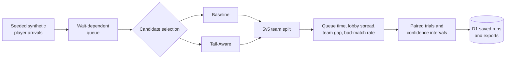

# RiftQueue

**A high-ELO matchmaking simulation that makes queue-time and lobby-quality
tradeoffs inspectable.**

I built RiftQueue after playing high-ELO ranked games where a lobby could look
balanced on paper yet feel inconsistent in practice. A close team-average MMR
can still hide one player far outside the rest of the lobby, especially as the
population thins out late at night. I wanted a concrete way to ask: how much
extra waiting is worth a meaningfully tighter match?

RiftQueue is a synthetic research tool, not a reconstruction of Riot Games'
matchmaking. It uses no Riot data, hidden MMR, production rules, player
population data, or internal infrastructure.

## Strongest Validated Result

In the locked **Late-night / Balanced** synthetic benchmark, Tail-Aware reduced
the bad-match rate from **61.65% to 35.28%**: a **26.38 percentage-point**
reduction. The cost was **10.95 additional seconds** of median queue time.

That result describes this simulation only. It does not predict, measure, or
make a claim about Riot's production matchmaking.

Across five locked configurations, Tail-Aware traded queue time for lower
synthetic lobby spread, team gap, and bad-match rate. The [findings report](docs/results/findings.md)
contains every effect size, confidence interval, ablation, and sensitivity check.

## What I Built

- A discrete-event simulator for sparse, high-ELO 5v5 queues.
- A **Baseline** matcher: expanding skill window plus snake-draft teams.
- A **Tail-Aware** matcher: protects the ends of the synthetic MMR distribution
  and evaluates a lower-cost 5v5 split.
- Browser experiments with streamed progress, saved runs, and JSON/CSV exports.
- A fixed-seed benchmark pipeline with paired trials and confidence intervals.

## How It Works



## Technical Decisions

- **Fair comparison:** both matchers receive the same seeded arrival stream.
- **Evidence over a single average:** official results use eight locked trials
  of 500 completed matches per matcher and paired 95% confidence intervals.
- **Separable choices:** the ablation distinguishes candidate selection from
  team balancing instead of crediting all change to one heuristic.
- **Safe public workflows:** creation is fixed-workload, rate-limited,
  idempotent, session-scoped, and retained with bounded D1 cleanup.

## What It Says And What It Does Not

The Late-night / Balanced ablation attributes queue time, lobby spread, and the
default bad-match change to candidate selection; optimized balancing mostly
improves team-average gap. Every one of the 16 predeclared threshold cells kept
a lower synthetic bad-match rate for Tail-Aware plus optimized balancing.

The overnight population is the key limitation: both matchers still flagged more
than 90% of synthetic lobbies as bad. RiftQueue does not model parties, ping,
regions, roles, abandonment, rematches, or Riot's private inputs. Its intervals
quantify simulated variation, not accuracy against a production system.

## Explore The Evidence

- [Architecture and methodology](docs/architecture.md)
- [Benchmark plan](docs/benchmarks.md)
- [Official findings](docs/results/findings.md)
- [Result artifact](docs/results/official-benchmark-results.json) and
  [validation artifact](docs/results/official-benchmark-validation.json)

## Run Locally

Requires Node.js `>=22.15.0`.

```bash
npm ci
npm run db:migrate:local
npm run db:inspect:local
npm run dev
```

The local D1 commands use checked-in configuration and ignored `.wrangler/`
state only. They cannot target the hosted D1 database.

## Testing And CI

GitHub Actions runs on every pull request and push to `main` using Ubuntu,
Node.js `22.15.0`, `npm ci`, dependency caching, and read-only permissions. It
requires lint, local D1 migration/schema verification, a production build,
simulation invariants, and API tests, without production secrets.

Linux or Codex cloud:

```bash
npm run lint
npm run db:migrate:local
npm run db:inspect:local
npm test
```

macOS environments without GNU `timeout` can use `npm run test:local` instead
of `npm test`.

## License

No open-source license has been selected. All rights reserved.
